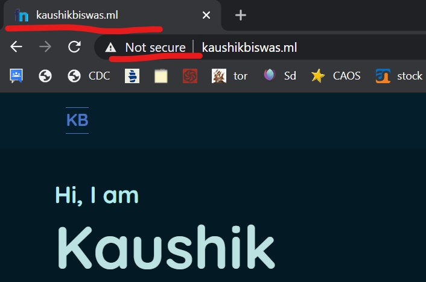
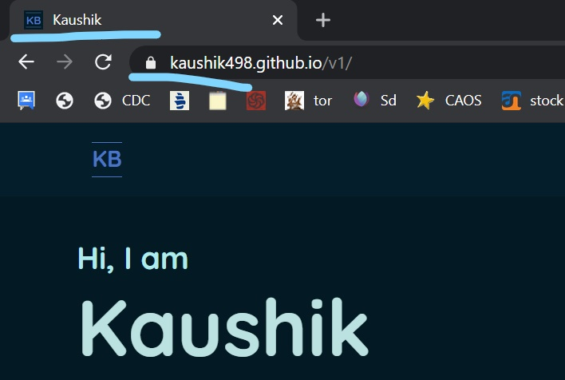
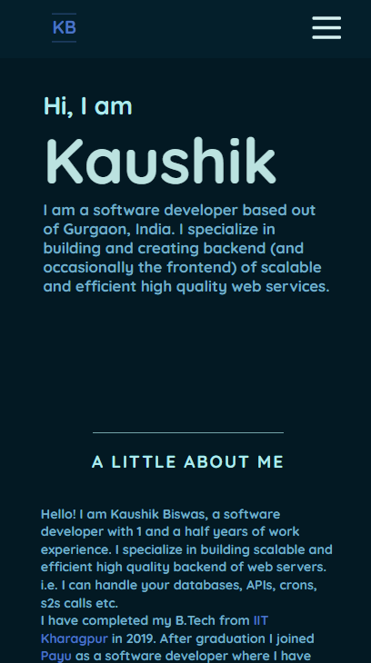
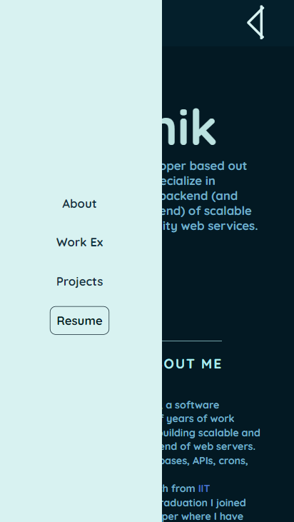
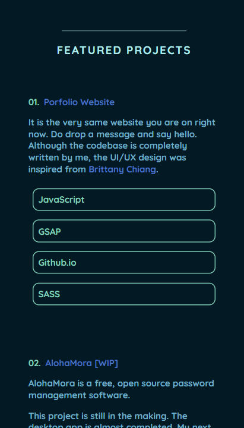
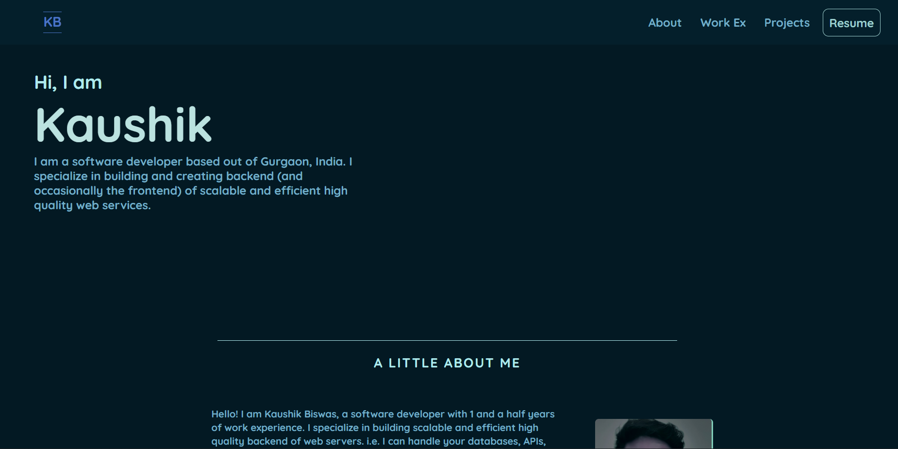
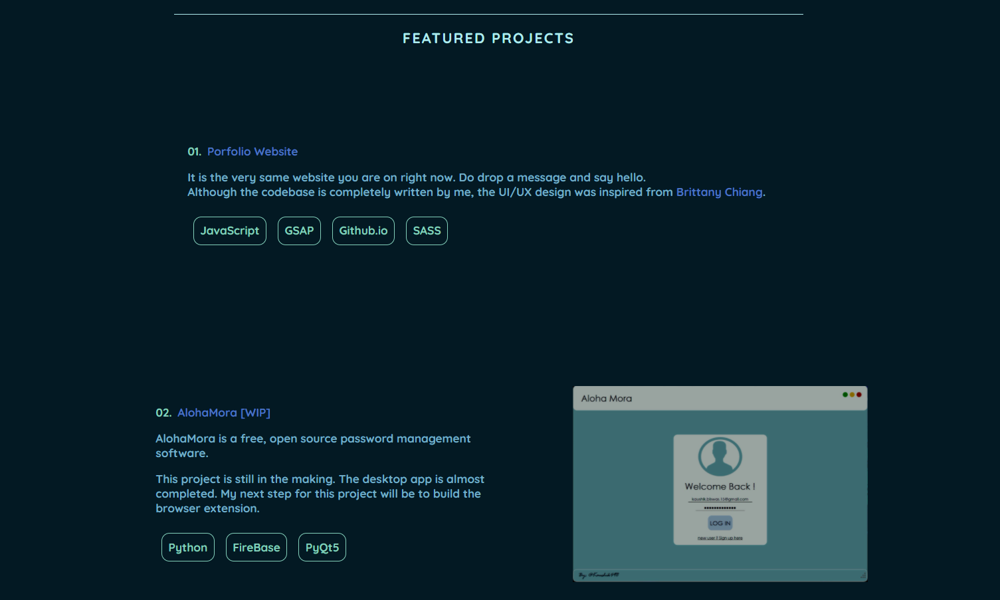

# Portfolio-Website

## Description
Hi! I am Kaushik. This is my portfolio website, version 1. This website is built using HTML, CSS, SASS, and JavaScript. I am Using GSAP3 for animations. 

Full disclosure, I am not a front end developer, mostly work in the back-end. So the terminologies used here might not be correct. E.g. I am still not sure if the starting dialogue of the page is called a hero section or the YouTuber I watched calls it a hero section. 

The codebase is completely written by me. But the UI/UX design was inspired from [_Brittany Chiang_](https://brittanychiang.com/). Check her out, her website is wesome.


## Code walk-through

This is not that complicated website. This just a static website hosted on [GitHub Pages](https://pages.github.com/). I did acquire a domain name *http://kaushikbiswas.ml*. As you might have guessed from the extension this is a free domain name [Freenome](https://www.freenome.com/). 

A helpful note, using this domain will force the website to use HTTP instead of HTTPS and this also remove your logo/name from the browser title. 





### Important files
- index.html (base HTML file)
- css/main.css (autogenerated css file using live SASS compiler)
- css/main.scss (SASS file for, well everything)
- js/app.js (Animation file)

This is a responsive website. I have covered responsiveness till the screen width is as small as 250px using media queries (of course). 

I have used JS only for the animations. 

## Demo 

The website URL is 
- https://kaushik498.github.io/v1/
- http://kaushikbiswas.ml

Both are working as of now. 

### Mobile Version





### PC Version





## Clone the repo
```
git clone https://github.com/Kaushik498/v1.git
```